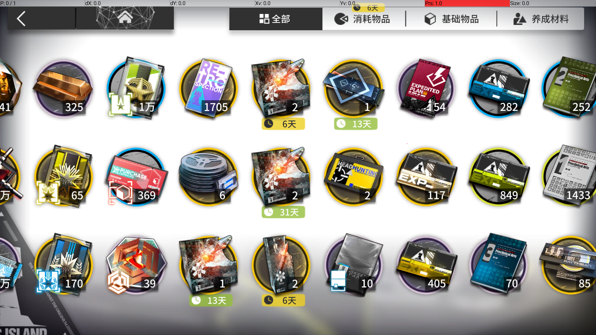
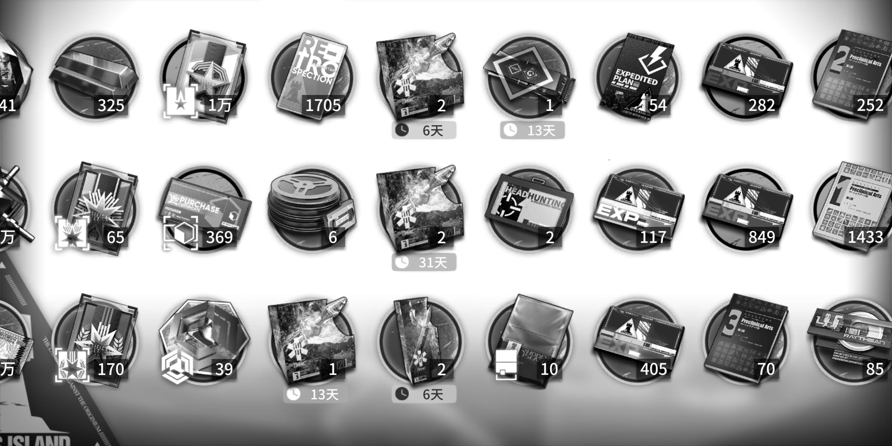

## DepotAnalyzer

**DepotMatchData** 中定义的 roi 为 `[0, 0, 1066, 599]`

换算到 2560x1440 下为 `[0, 0, 2132, 1198]`

Maa 中 1280x720 分辨率下任务中定义的物品 roi 为 `[0, 190, 156, 190]`

`start_y` 为 `190`，宽高周期分别为 `156` 和 `190`

换算到 2560x1440 下：

`start_y` 为 `380`，宽高周期为 `312` 和 `380`

这个 `start_y` 恰好位于物品的中心位置。

将图像转换为灰度值，按 y 轴拍扁计算平均值，于是可以视作一个信号，而这个信号的关键组成部分就是包含着由物品排列产生的周期信号。

借助傅里叶变换，可以得到其相位，也即第一列物品的 x 中心坐标。

归一化：

