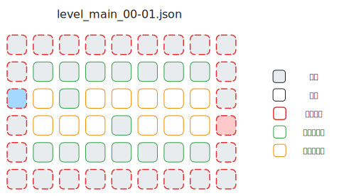
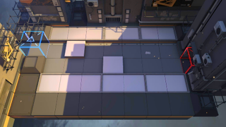

## 一、关卡

### 1. 地块（tile）

每一个关卡地图可以看作是一张二维网格，其中的每一个格子被称作 **地块（tile）**。

一个地块有如下属性：

- 地块类型 `tileKey`：
  - `tile_forbidden`
  - `tile_wall`
  - `tile_road`
  - 红门 `tile_start`
  - 蓝门 `tile_end`
- 高度类型 `heightType`：
  - 高台 `HIGHLAND`
  - 地面 `LOWLAND`
- 可放置干员类型 `buildableType`：
  - 近战 `MELEE`
  - 远程 `RANGED`
  - 不可放置 `NONE`
- 可通过类型 `passableMask`：
  - `ALL`
  - `FLY_ONLY`
- `playerSideMask`：
  - `ALL`
- `blackboard`
- `effects`

地图由一个地块的二维数组定义，左上角地块坐标为 `(0, 0)`。

以 [ArknightsGameData/zh_CN/gamedata/levels/obt/main/level_main_00-01.json](https://github.com/Kengxxiao/ArknightsGameData/blob/1a2cdabe0dc09f45c43cbe04503e4a7f2b0a178b/zh_CN/gamedata/levels/obt/main/level_main_00-01.json) 为例：

符合 0-1 地图：

### 2. 路线（route）

**路线（route）**规定了敌人的动作轨迹，有多种 *运动类型* `motionMode`。

#### `E_NUM` 类型

未知

#### `WALK` 类型

- `startPosition`：起始位置
- `endPosition`：结束位置
- `spawnRandomRange`
- `spawnOffset`
- `checkpoints`：检查点（见下）

### 3. 检查点（checkpoint）

**检查点（checkpoint）**规定了路线中途敌人的行为方式，敌人会按照检查点列表依次完成对应的动作。

**检查点** 有多种 *类型* `type`。

- `type` 类型
- `time`
- `position`
- `reachOffset`
- `randomizeReachOffset`
- `reachDistance`

#### `MOVE` 类型

移动到 `position`

#### `WAIT_FOR_SECONDS` 类型

等待指定秒数 `time`

## 一、坐标与路线

### 1. 地块坐标